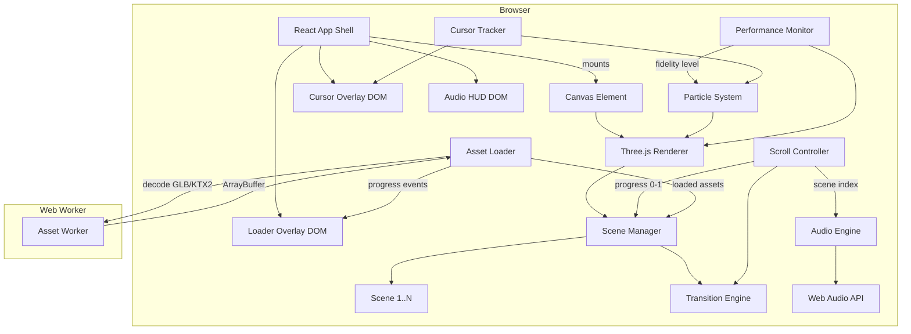

# Design Document: Hyper-Visual Product Marketing Website

## Overview

This document describes the technical architecture for a hyper-visual, award-winning product marketing website. The site delivers an immersive, cinematic experience through WebGL/WebGPU-powered 3D rendering, GPU-accelerated particle systems, scroll-driven animation timelines, and a premium micro-interaction layer. The target quality bar is Awwwards-level UI/UX.

The stack is built around **Three.js** (WebGL renderer with WebGPU upgrade path), **GSAP ScrollTrigger** for scroll-driven timelines, **React** as the component shell, and **Vite** as the build tool. Audio is handled via the **Web Audio API**. Property-based tests use **fast-check** (TypeScript).

### Key Design Decisions

- **Three.js over Babylon.js**: Larger ecosystem, better GSAP integration, lighter bundle when tree-shaken.
- **GSAP ScrollTrigger over custom scroll logic**: Battle-tested, handles scroll locking, scrub, and pin natively.
- **Instanced mesh rendering for particles**: Single draw call for up to 50k particles; avoids per-object overhead.
- **React as a thin shell**: React manages DOM UI (cursor, HUD, loader overlay). Three.js owns the canvas. No React re-renders inside the render loop.
- **Web Workers for asset decoding**: GLB parsing and texture decompression happen off the main thread to protect FCP.

---

## Architecture



### Rendering Pipeline

```
requestAnimationFrame loop
  └─ PerformanceMonitor.sample()
  └─ ScrollController.update()
  └─ ParticleSystem.tick(delta)
  └─ SceneManager.update(delta)
  └─ Renderer.render(activeScene, camera)
```

All animation state is driven by a single `rAF` loop. GSAP timelines are ticked manually via `gsap.ticker` to stay in sync with the Three.js loop.

---

## Components and Interfaces

### SceneManager

Owns the ordered list of scenes and delegates to `TransitionEngine` when a scene change is requested.

```ts
interface SceneManager {
  scenes: Scene[];
  activeIndex: number;
  transitionTo(index: number): Promise<void>;
  update(delta: number): void;
}
```

### Scene

Each scene is a self-contained Three.js `Group` with its own animation timeline.

```ts
interface Scene {
  id: string;
  group: THREE.Group;
  enter(): gsap.core.Timeline;
  exit(): gsap.core.Timeline;
  update(delta: number): void;
  dispose(): void;
}
```

### ScrollController

Maps normalised scroll progress (0–1 per scene) to GSAP scrub timelines. Locks scroll during transitions.

```ts
interface ScrollController {
  locked: boolean;
  currentScene: number;
  progress: number; // 0-1 within current scene
  lock(): void;
  unlock(): void;
  onSceneChange(cb: (index: number) => void): void;
}
```

### TransitionEngine

Executes bespoke enter/exit animation pairs between scenes. Duration is configurable per transition (600–1200ms).

```ts
interface TransitionEngine {
  execute(from: Scene, to: Scene, durationMs: number): Promise<void>;
}
```

### ParticleSystem

GPU-instanced particle engine. Manages pools of `THREE.InstancedMesh` objects.

```ts
interface ParticleSystem {
  maxParticles: number;       // up to 50,000
  activeCount: number;
  emit(config: EmitConfig): void;
  explode(origin: THREE.Vector3): void;
  dissolve(durationMs: number): void;
  setFidelityLevel(level: FidelityLevel): void;
  tick(delta: number): void;
}

interface EmitConfig {
  count: number;
  targetPositions: Float32Array; // product shape point cloud
  durationMs: number;
}

type FidelityLevel = 'high' | 'medium' | 'low';
```

### PerformanceMonitor

Samples FPS over a rolling window and emits fidelity change events.

```ts
interface PerformanceMonitor {
  currentFPS: number;
  fidelityLevel: FidelityLevel;
  onFidelityChange(cb: (level: FidelityLevel) => void): void;
  sample(timestamp: number): void;
}
```

### AssetLoader

Manages prioritised asset loading with retry logic and fallback substitution.

```ts
interface AssetLoader {
  load(manifest: AssetManifest): void;
  preloadScene(index: number): void;
  onProgress(cb: (pct: number) => void): void;
  onComplete(cb: () => void): void;
  onError(cb: (asset: AssetEntry, attempt: number) => void): void;
}

interface AssetManifest {
  critical: AssetEntry[];   // hero + scene 1-2
  deferred: AssetEntry[];   // scenes 3+
}

interface AssetEntry {
  url: string;
  type: 'glb' | 'ktx2' | 'hdr' | 'mp3';
  fallbackUrl?: string;
  maxRetries: number;       // default 3
}
```

### CursorTracker

Tracks pointer position and drives the custom cursor DOM element and magnetic attraction logic.

```ts
interface CursorTracker {
  position: { x: number; y: number };
  targetElement: HTMLElement | null;
  update(event: PointerEvent): void;
  registerMagneticTarget(el: HTMLElement, radius: number): void;
  onIdle(durationMs: number, cb: () => void): void;
}
```

### AudioEngine

Wraps the Web Audio API. Manages ambient soundscape and spatial SFX.

```ts
interface AudioEngine {
  enabled: boolean;
  toggle(): void;
  setScene(index: number): void;
  playSFX(id: string, position?: THREE.Vector3): void;
}
```

---

## Data Models

### FidelityProfile

Defines rendering parameters for each fidelity tier.

```ts
interface FidelityProfile {
  level: FidelityLevel;
  maxParticles: number;       // high: 50000, medium: 25000, low: 5000
  postProcessing: boolean;    // high: true, medium: false, low: false
  shadowMapEnabled: boolean;
  textureResolution: 'full' | 'half' | 'quarter';
  targetFPS: number;          // high: 60, medium: 45, low: 30
}
```

### ProductModel

Represents a single marketed product and its associated 3D assets.

```ts
interface ProductModel {
  id: string;
  name: string;
  glbUrl: string;
  fallbackGlbUrl: string;
  pointCloudUrl: string;      // pre-baked Float32Array for particle target positions
  pbrMaps: {
    diffuse: string;
    specular: string;
    roughness: string;
    normal: string;
    envMap: string;
  };
  entranceDurationMs: number; // default 800
}
```

### SceneConfig

Declarative configuration for each scene, consumed by SceneManager at startup.

```ts
interface SceneConfig {
  id: string;
  order: number;              // 1-based, determines scroll order
  products: ProductModel[];
  transitionIn: TransitionConfig;
  transitionOut: TransitionConfig;
  ambientAudioTrack?: string;
}

interface TransitionConfig {
  type: 'dissolve' | 'shatter' | 'warp' | 'curtain' | 'morph';
  durationMs: number;         // 600-1200
}
```

### LoaderState

Tracks asset loading progress for the branded loader UI.

```ts
interface LoaderState {
  phase: 'loading' | 'revealing' | 'complete';
  progress: number;           // 0-100
  failedAssets: AssetEntry[];
  retryCount: Record<string, number>;
}
```

### CursorState

Reactive state for the custom cursor DOM element.

```ts
interface CursorState {
  x: number;
  y: number;
  shape: 'default' | 'hover' | 'drag' | 'click';
  scale: number;
  magnetTarget: { x: number; y: number } | null;
  idleAnimating: boolean;
}
```

---


## Correctness Properties

*A property is a characteristic or behavior that should hold true across all valid executions of a system — essentially, a formal statement about what the system should do. Properties serve as the bridge between human-readable specifications and machine-verifiable correctness guarantees.*

### Property 1: Scroll progress mapping is monotonically non-decreasing

*For any* sequence of increasing scroll positions within a single scene, the mapped animation progress values produced by `ScrollController` must be monotonically non-decreasing and always within [0, 1].

**Validates: Requirements 2.1**

---

### Property 2: Transition duration is always within [600, 1200]ms

*For any* `TransitionConfig`, the `durationMs` value must be clamped to the range [600, 1200]. No transition may be shorter than 600ms or longer than 1200ms.

**Validates: Requirements 2.2**

---

### Property 3: Scroll is locked for the full duration of a transition

*For any* scene transition initiated via `SceneManager.transitionTo()`, `ScrollController.locked` must be `true` from the moment the transition starts until the returned `Promise` resolves.

**Validates: Requirements 2.3**

---

### Property 4: Final scene blocks downward scroll

*For any* scroll input received when `ScrollController.currentScene` equals the index of the last scene, the controller must not advance to a scene beyond the last and must not increment `currentScene`.

**Validates: Requirements 2.5**

---

### Property 5: Hover always emits at least 2,000 particles

*For any* `EmitConfig` produced by a `Product_Card` hover event, `EmitConfig.count` must be greater than or equal to 2,000.

**Validates: Requirements 3.1**

---

### Property 6: All ProductModel instances have complete PBR map definitions

*For any* `ProductModel` in the scene configuration, all four PBR map fields (`diffuse`, `specular`, `roughness`, `normal`) and the `envMap` field must be non-empty strings.

**Validates: Requirements 4.1**

---

### Property 7: Drag-to-rotate applies a 1:1 angular ratio

*For any* pointer drag delta `(dx, dy)` applied to a product model, the resulting rotation delta `(dRotX, dRotY)` must equal `(dy, dx)` in radians (pointer pixels map 1:1 to rotation angle in the configured unit).

**Validates: Requirements 4.2**

---

### Property 8: PerformanceMonitor reduces fidelity after sustained low FPS

*For any* stream of FPS samples where every sample is below 45 and the stream spans more than 2 seconds, `PerformanceMonitor.fidelityLevel` must transition to a lower tier and `FidelityProfile.postProcessing` must be `false`.

**Validates: Requirements 5.1**

---

### Property 9: PerformanceMonitor restores fidelity after sustained high FPS

*For any* `PerformanceMonitor` that has previously reduced fidelity, if it subsequently receives a stream of FPS samples all above 55 spanning more than 2 seconds, `fidelityLevel` must return to the previous (higher) tier.

**Validates: Requirements 5.2**

---

### Property 10: Custom cursor lag is always within [40, 80]ms

*For any* `CursorTracker` configuration, the configured lag parameter must be within the range [40, 80]ms. Values outside this range must be clamped or rejected at construction time.

**Validates: Requirements 6.1**

---

### Property 11: Click ripple originates at click coordinates

*For any* click event at coordinates `(x, y)`, the ripple/burst effect emitted by `CursorTracker` must have its origin set to `(x, y)`.

**Validates: Requirements 6.3**

---

### Property 12: Magnetic attraction activates within 40px and not beyond

*For any* pointer position and registered magnetic target element, the magnetic pull must be applied if and only if the pointer is within 40px of the element's boundary. For positions strictly beyond 40px, `CursorState.magnetTarget` must be `null`.

**Validates: Requirements 6.4**

---

### Property 13: Idle detection triggers after 5 seconds of no input

*For any* `CursorTracker` instance, if no pointer events are received for 5 or more seconds, `CursorState.idleAnimating` must become `true`. Receiving any pointer event must reset the idle timer and set `idleAnimating` to `false`.

**Validates: Requirements 6.5**

---

### Property 14: Audio scene track changes with active scene

*For any* call to `AudioEngine.setScene(index)`, the active ambient audio track must switch to the track configured for that scene index.

**Validates: Requirements 7.2**

---

### Property 15: Spatial SFX plays if and only if audio is enabled

*For any* particle explosion event, `AudioEngine.playSFX` must be called if `AudioEngine.enabled` is `true`, and must not be called if `AudioEngine.enabled` is `false`.

**Validates: Requirements 7.3**

---

### Property 16: Haptic pulse duration is within [30, 60]ms

*For any* `Product_Card` click on a device that supports the Vibration API, the duration passed to `navigator.vibrate()` must be within [30, 60]ms.

**Validates: Requirements 7.4**

---

### Property 17: Loader progress is monotonically non-decreasing and bounded

*For any* sequence of progress events emitted by `AssetLoader`, each successive `LoaderState.progress` value must be greater than or equal to the previous value, and all values must be within [0, 100].

**Validates: Requirements 8.1**

---

### Property 18: Cinematic reveal duration is within [800, 1500]ms

*For any* reveal animation triggered by `AssetLoader.onComplete`, the configured animation duration must be within [800, 1500]ms.

**Validates: Requirements 8.2**

---

### Property 19: Critical assets are enqueued before deferred assets

*For any* `AssetManifest`, all entries in `manifest.critical` must be fetched (or at least enqueued) before any entry in `manifest.deferred` begins loading.

**Validates: Requirements 8.3**

---

### Property 20: Asset retry exhaustion triggers fallback substitution

*For any* `AssetEntry` with `maxRetries = 3`, if the fetch fails on all 3 attempts, the loader must substitute `fallbackUrl` for the original `url` on the final attempt. For any number of failures fewer than 3, the loader must retry the original URL.

**Validates: Requirements 8.4**

---

### Property 21: Cursor coordinate mapping preserves direction

*For any* pointer position `(x, y)` within the Hero_Section viewport, the parallax/distortion offset applied to the 3D scene must be a continuous, direction-preserving function of `(x, y)` — moving the cursor right must increase the horizontal offset, and moving it down must increase the vertical offset.

**Validates: Requirements 1.3**

---

### Property 22: Mobile input mapping preserves direction

*For any* gyroscope tilt delta or touch-drag delta `(dx, dy)`, the resulting 3D scene rotation must be in the same direction as the input delta (positive dx → positive scene rotation on the corresponding axis).

**Validates: Requirements 1.5**

---

## Error Handling

### WebGL / WebGPU Capability Detection

At startup, the `AssetLoader` and `3D_Renderer` run a capability probe:

1. Attempt to acquire a `WebGPU` adapter → use WebGPU renderer.
2. Fall back to `WebGL 2.0` context → use Three.js WebGL renderer.
3. Fall back to `WebGL 1.0` → use Three.js with reduced feature set.
4. No WebGL → render the 2D CSS animated fallback; skip all Three.js initialisation.

The `ParticleSystem` checks for WebGL 2.0 specifically (required for instanced mesh). If unavailable, it substitutes a CSS keyframe animation that approximates the particle effect.

### Asset Loading Failures

- Each `AssetEntry` is retried up to `maxRetries` times (default 3) with exponential backoff (200ms, 400ms, 800ms).
- After exhausting retries, `fallbackUrl` is used if provided. If no fallback exists, the asset is skipped and the scene renders without it.
- The `LoaderState.failedAssets` array is populated for diagnostic logging.
- A non-blocking toast notification informs the visitor if a critical asset could not be loaded.

### Audio Autoplay Policy

- `AudioEngine.toggle()` wraps `AudioContext.resume()` in a try/catch.
- If the browser blocks autoplay, the caught error sets a `promptVisible` flag in the audio HUD state, surfacing a non-intrusive "Enable Audio" button.
- All audio operations are no-ops when `AudioEngine.enabled` is `false`.

### Performance Degradation

- `PerformanceMonitor` uses a 2-second rolling window of FPS samples.
- Fidelity reductions are applied atomically: particle count halved, post-processing disabled, shadow maps disabled.
- Fidelity is never reduced below the `'low'` tier to ensure the site remains functional.
- Restoration requires a sustained 2-second window above 55 FPS to prevent oscillation.

### Scroll Edge Cases

- `ScrollController` ignores scroll events while `locked === true`.
- At the final scene, downward scroll is swallowed (no default prevented globally — only within the scroll handler).
- Rapid scroll (trackpad momentum) is debounced to prevent multiple simultaneous transition triggers.

---

## Testing Strategy

### Dual Testing Approach

Both unit tests and property-based tests are required. They are complementary:

- **Unit tests** cover specific examples, integration points, edge cases, and error conditions.
- **Property-based tests** verify universal correctness across randomised inputs, catching edge cases that hand-written examples miss.

### Property-Based Testing

**Library**: `fast-check` (TypeScript/JavaScript)

Each correctness property from this document must be implemented as a single `fast-check` property test. Tests must run a minimum of **100 iterations** each.

Tag format for each test:
```
// Feature: hyper-visual-product-website, Property N: <property_text>
```

Example:

```ts
// Feature: hyper-visual-product-website, Property 7: Drag-to-rotate applies a 1:1 angular ratio
it('applies 1:1 angular ratio on drag', () => {
  fc.assert(
    fc.property(fc.float(), fc.float(), (dx, dy) => {
      const { dRotX, dRotY } = applyDragRotation(dx, dy);
      expect(dRotX).toBeCloseTo(dy);
      expect(dRotY).toBeCloseTo(dx);
    }),
    { numRuns: 100 }
  );
});
```

Properties to implement as PBT tests: 1–22 (all properties listed above).

### Unit Testing

Unit tests focus on:

- **Specific examples**: loader progress sequence [0, 25, 50, 75, 100], transition duration boundary values (600, 1200).
- **Integration points**: `ScrollController` → `TransitionEngine` → `SceneManager` handoff.
- **Edge cases**: empty `AssetManifest`, zero-particle emit config, cursor at viewport boundary.
- **Error conditions**: WebGL unavailable, all asset retries exhausted, audio autoplay blocked.

Avoid writing unit tests that duplicate property test coverage. Unit tests should focus on concrete scenarios that are hard to express as universal properties.

### Visual / E2E Testing

- **Playwright** for smoke tests: page loads, loader completes, hero section is visible.
- **Lighthouse CI** integrated into the pipeline to enforce the score thresholds (≥70 desktop, ≥55 mobile).
- Manual Awwwards-style review checklist for subjective visual quality gates (legibility, animation smoothness, cursor feel).

### Test File Organisation

```
src/
  __tests__/
    unit/
      scrollController.test.ts
      transitionEngine.test.ts
      particleSystem.test.ts
      assetLoader.test.ts
      performanceMonitor.test.ts
      cursorTracker.test.ts
      audioEngine.test.ts
    property/
      scrollController.property.ts
      transitionEngine.property.ts
      particleSystem.property.ts
      assetLoader.property.ts
      performanceMonitor.property.ts
      cursorTracker.property.ts
      audioEngine.property.ts
      productModel.property.ts
    e2e/
      smoke.spec.ts
```
